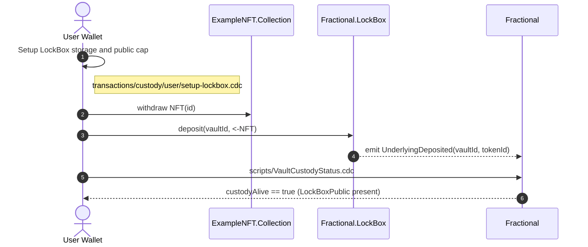
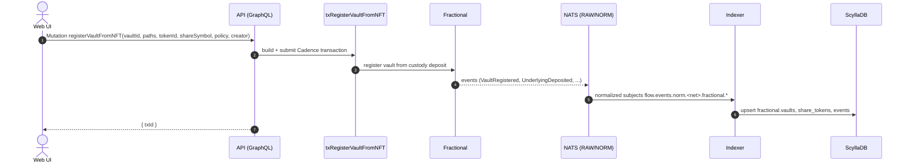
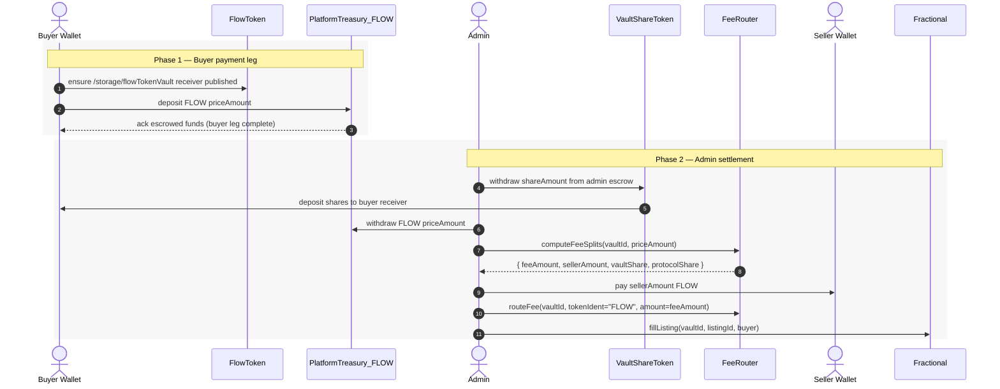
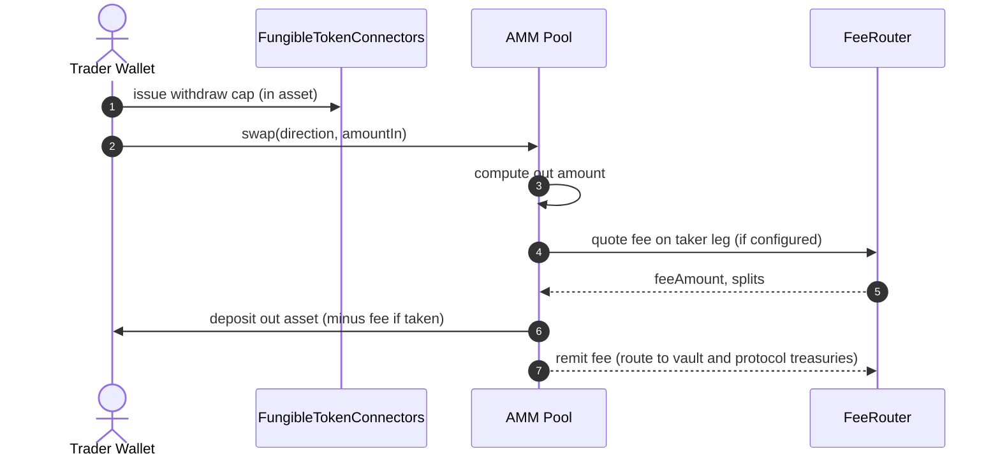
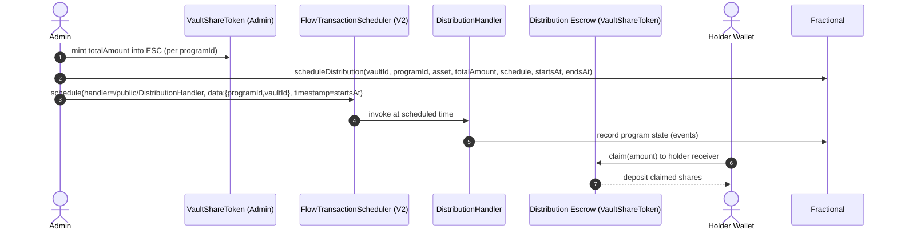
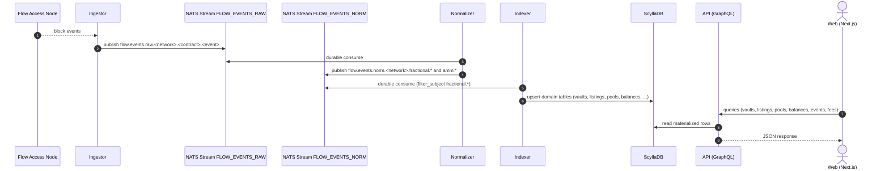
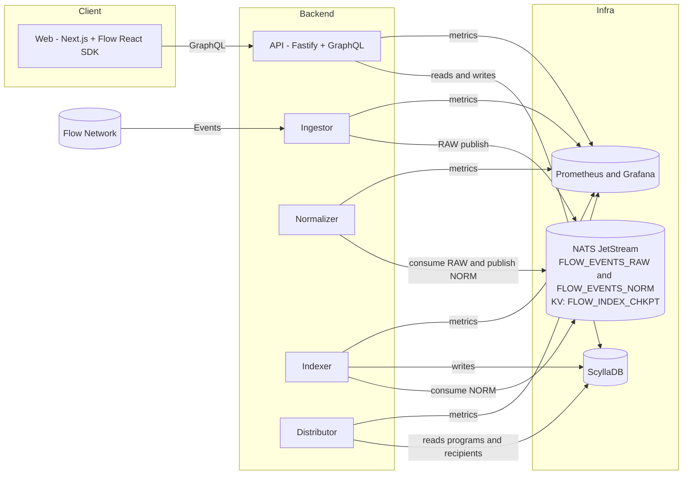
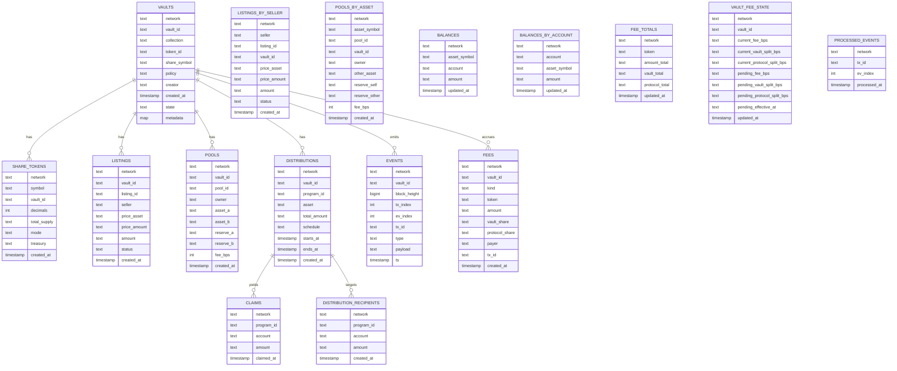

## Phase 1 Mermaid Diagrams (Flows, Architecture, ER)

Contents

- Custody setup (LockBox)
- Vault registration from deposited NFT
- Listing fill and settlement
- AMM swap (SHARE/FLOW)
- Distribution schedule and claim
- Event pipeline (indexing)
- Component architecture
- ER data model

### Custody setup (LockBox) — sequence

Sources: `docs/custody-process.md`, `flow/cadence/transactions/custody/user/setup-lockbox.cdc`, `flow/cadence/scripts/VaultCustodyStatus.cdc`

### Vault registration from deposited NFT — sequence

Sources: `services/api/src/graphql/schema/index.ts`, `services/api/src/tx/vaults.ts`, `flow/cadence/transactions/*`

### Listing fill and settlement — sequence

Sources: `flow/cadence/transactions/listings/user/pay.cdc`, `flow/cadence/transactions/listings/admin/settle-fill.cdc`, `flow/cadence/contracts/FeeRouter.cdc`

### AMM swap (SHARE/FLOW) — sequence

Sources: `flow/cadence/contracts/amm/*`, `flow/cadence/contracts/FeeRouter.cdc`, `flow/cadence/{transactions,scripts}/pools/*`

### Distribution schedule and claim — sequence

Sources: `flow/cadence/transactions/distributions/admin/schedule.cdc`, `flow/cadence/contracts/scheduler/*`, `flow/cadence/transactions/distributions/user/*`

### Event pipeline (indexing) — sequence

Sources: `services/ingestor/src/index.ts`, `services/normalizer/src/index.ts`, `services/indexer/src/index.ts`, `infra/nats/js/*`

### Component architecture — component diagram

Sources: `docker-compose.yml`, `services/*/src/index.ts`, `infra/nats/*`, `infra/scylla/*`

### ER data model — Mermaid erDiagram

Sources: `infra/scylla/001_core.cql`
